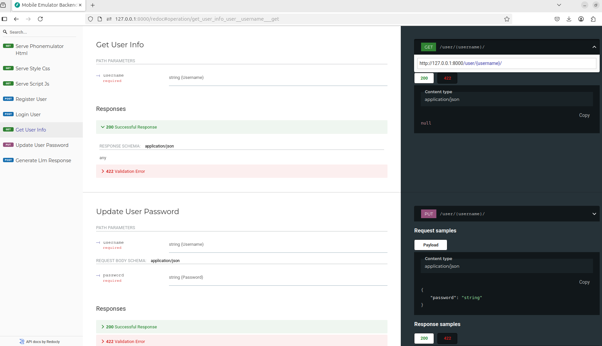
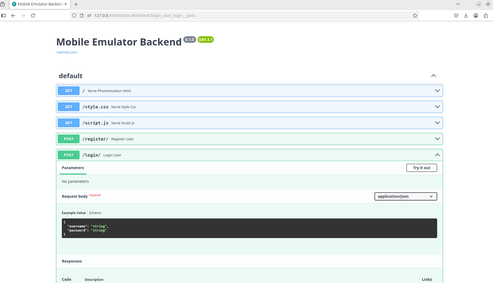

# Демонстрація бекенду на FastAPI та фронтенду у вигляді емулятора мобільного телефону

Цей проєкт демонструє простий бекенд API, створений за допомогою FastAPI, та відповідний фронтенд на HTML/CSS/JS, розроблений для емуляції екрана мобільного додатка.

Основні цілі — продемонструвати:
*   Базове керування користувачами (Реєстрація, Вхід, Отримання інформації, Оновлення) з використанням сховища в пам’яті.
*   Проксування запитів до Великої Мовної Моделі (LLM) через бекенд (зокрема, Ollama).
*   Логування взаємодій з API в реальному часі, що надсилається з бекенду до фронтенд-емулятора за допомогою WebSockets.
*   Роздачу статичного фронтенду (HTML, CSS, JS) безпосередньо з FastAPI.
*   **Автоматичну інтерактивну документацію API** (Swagger UI та ReDoc), згенеровану FastAPI.
*   Пояснювальний текст у фронтенді, що висвітлює ширші концепції бекенду та розробки програмного забезпечення.


## Можливості

*   **Керування користувачами:**
    *   POST `/register/`: Реєстрація нового користувача.
    *   POST `/login/`: Вхід користувача.
    *   GET `/user/{username}/`: Отримання базової інформації про користувача.
    *   PUT `/user/{username}/`: Оновлення пароля користувача.
    *   (Примітка: Для демонстрації використовується простий, незахищений словник у пам’яті).
*   **Взаємодія з LLM:**
    *   POST `/llm/generate`: Приймає ім'я користувача та запит (prompt), перевіряє існування користувача (псевдо-автентифікація), надсилає запит до екземпляра Ollama та повертає згенерований текст.
*   **Логування в реальному часі:**
    *   WebSocket ендпоінт `/ws/logs` транслює детальні логи запитів клієнта, відповідей сервера та взаємодій з Ollama усім підключеним клієнтам фронтенду.
*   **Автоматична документація API:**
    *   FastAPI автоматично генерує інтерактивну документацію API з вашого коду.
    *   **Swagger UI:** Доступний за адресою `/docs`. Дозволяє досліджувати та тестувати ендпоінти API безпосередньо у браузері.
    *   **ReDoc:** Доступний за адресою `/redoc`. Надає альтернативний вигляд документації.

      
<p align="center"> <!-- Optional: Centers the images -->
  
    <!-- Optional: Adds a small space between images -->
  
</p>

    

*   **Фронтенд-емулятор мобільного:**
    *   Простий інтерфейс, що роздається з `/` і нагадує екран телефону.
    *   Елементи керування для управління користувачами та взаємодії з LLM.
    *   Спеціальна область для відображення логів реального часу, отриманих через WebSocket.
    *   Розділи, що пояснюють такі поняття, як архітектура бекенду, бази даних, автентифікація, LLM, WebSockets, DevOps та безпека.

## Стек технологій

*   **Бекенд:** Python 3, FastAPI, Uvicorn
*   **Взаємодія з API:** httpx (для виклику Ollama)
*   **Реальний час:** WebSockets (інтеграція з FastAPI)
*   **Фронтенд:** HTML, CSS, JavaScript
*   **LLM:** Ollama (запущений локально)
*   **Документація API:** OpenAPI, Swagger UI, ReDoc (через FastAPI)

## Передумови

*   **Python:** Рекомендована версія 3.7+.
*   **pip:** Інсталятор пакетів Python.
*   **Ollama:**
    *   Сервер Ollama встановлений та запущений.
    *   Переконайтеся, що він доступний за адресою `http://localhost:11434` (Зверніть увагу на порт **11434**, що використовується в `main.py`). Зазвичай його можна запустити командою `ollama serve`. *Якщо ваш Ollama працює на стандартному порту 1143, вам потрібно буде змінити `ollama_url` у файлі `main.py`.*
    *   Завантажена модель, наприклад, `llama2`: `ollama pull llama2`
*   **Git:** (Опціонально, для клонування)

## Налаштування та Встановлення

1.  **Клонуйте репозиторій (Опціонально):**
    ```bash
    git clone <repository-url>
    cd <repository-directory>
    ```
    Або просто розмістіть `main.py`, `phonemulator.html`, `style.css`, `script.js`, `requirements.txt` та `Makefile` в одній директорії.

2.  **Перейдіть до директорії проєкту:**
    ```bash
    cd /шлях/до/вашої/директорії/проєкту
    ```

3.  **Створіть та активуйте віртуальне оточення (Рекомендовано):**
    ```bash
    python3 -m venv .venv
    source .venv/bin/activate  # У Windows використовуйте `.\.venv\Scripts\activate`
    ```

4.  **Встановіть залежності:**
    ```bash
    pip install -r requirements.txt
    ```
    Або за допомогою Makefile:
    ```bash
    make install
    ```

## Запуск Додатка

1.  **Запустіть сервер Ollama:**
    Переконайтеся, що ваш сервер Ollama запущений і слухає на `http://localhost:11434`. Перевірте, чи є у вас необхідна модель (наприклад, `llama2`).
    ```bash
    ollama serve
    # (Залиште це працювати в окремому терміналі)
    ```

2.  **Запустіть бекенд FastAPI:**
    ```bash
    uvicorn main:app --reload --host 0.0.0.0 --port 8000
    ```
    Або за допомогою Makefile:
    ```bash
    make run
    ```
    Прапор `--reload` автоматично перезапускає сервер при виявленні змін у коді.

3.  **Доступ до додатка та документації:**
    *   **Фронтенд-емулятор:** Відкрийте ваш веббраузер за адресою `http://localhost:8000`
    *   **Документація Swagger UI:** Перейдіть за адресою `http://localhost:8000/docs`
    *   **Документація ReDoc:** Перейдіть за адресою `http://localhost:8000/redoc`

## Як користуватись

*   Використовуйте поля введення та кнопки на головній сторінці (`/`) для взаємодії з керуванням користувачами та LLM.
*   Спостерігайте за логами реального часу, що з’являються внизу головної сторінки.
*   Досліджуйте ендпоінти API детально та тестуйте їх безпосередньо за допомогою Swagger UI (`/docs`).
*   Розгортайте розділи "Огляд ширших концепцій" на головній сторінці, щоб прочитати пояснення щодо пов'язаних технологій.

## Структура Проєкту

```plaintext
.
├── main.py             # Логіка додатка FastAPI, ендпоінти API, WebSocket сервер
├── phonemulator.html   # HTML структура фронтенду та пояснювальний текст
├── style.css           # CSS для стилізації фронтенд-емулятора
├── script.js           # Логіка фронтенду на JavaScript, виклики API, WebSocket клієнт
├── requirements.txt    # Залежності Python
├── Makefile            # Допоміжні команди для розробки
└── README.md           # Цей файл
```

## Примітки та Обмеження

*   **База даних у пам’яті:** Дані користувачів зберігаються у словнику Python і втрачаються при перезапуску сервера. Це **не підходить для продакшену**.
*   **Базова автентифікація:** Вхід — це проста перевірка пароля. Не реалізовано належного керування сесіями (наприклад, JWT) або хешування паролів.
*   **Обробка помилок:** Базова обробка помилок включена, але може бути більш надійною для продакшен-сценаріїв.
*   **Залежність від Ollama:** Додаток вимагає запущеного екземпляра Ollama, налаштованого як зазначено.

## Використання Штучного Інтелекту (AI Assistance)

Значна частина коду та документації в цьому проєкті (включаючи структуру файлів, логіку функцій, цей README) була згенерована за допомогою великих мовних моделей (Google Gemini).

AI використовувався як інструмент для:
*   Генерації початкового коду на основі запитів (промптів).
*   Допомоги у написанні шаблонного коду (boilerplate).
*   Надання пропозицій щодо логіки та реалізації.
*   Генерації чорнових версій документації.

Весь код, згенерований ШІ, був перевірений, протестований та модифікований розробником.
